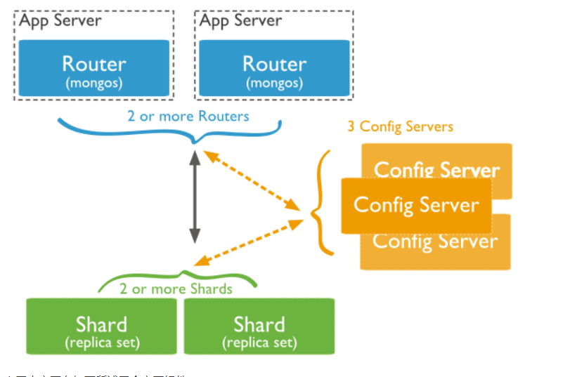

#### 备忘
```txt
考虑用 Sharded cluster 时通常是要解决如下2个问题：
  1.存储容量受单机限制，即磁盘资源遭遇瓶颈
  2.读写能力受单机限制（读能力也可以在复制集里加 secondary 来扩展）可能是 CPU、内存或网卡等资源瓶颈导致读写能力无法扩展
  如果你没有遇到上述问题，使用 MongoDB 复制集就足够了，管理维护上比 Sharded cluster 要简单很多
```
#### 下图展示了在 MongoDB 中使用分片集群的结构分布模型

```txt
1.Query Routers:  前端路由，客户端由此接入并且让整个集群像是单一数据库，前端应用可透明使用（客户端无需了解其他节点存在）
2.Config Server:  元数据服务器，存储了整个 Cluster Metadata，其中包括chunk信息...
3.Shard:          存储实际数据块，生产环境中1个Shard角色可由多个节点组个1个replica set承担来防止单点故障!
```
